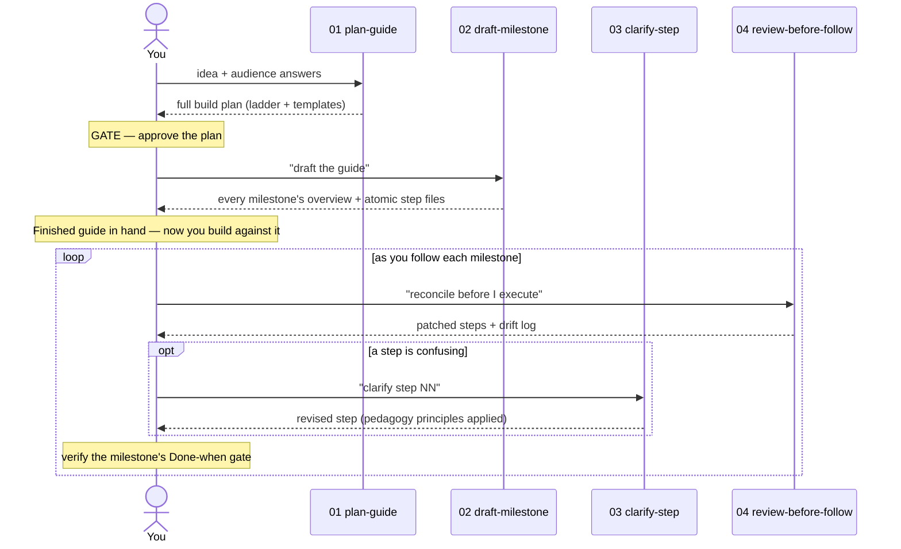

# EXPLAINER — GuideForge in full

> The complete walkthrough. The [README](README.md) is the overview; this document covers the same ground in
> depth. Read it top to bottom once, then use the section links as a reference.
>
> **No prior context is needed.** It starts from the rationale, then walks every file in the repo, then
> explains each rule and design decision.

---

## Contents

- [Skills at a glance](#skills-at-a-glance-cheat-sheet) — one-line recap of all eleven skills
1. [The problem, precisely](#1-the-problem-precisely)
2. [The core idea: learn-as-you-go](#2-the-core-idea-learn-as-you-go)
3. [The pillars](#3-the-pillars)
4. [How the pieces fit: the pipeline](#4-how-the-pieces-fit-the-pipeline)
5. [Every file, explained](#5-every-file-explained)
6. [The four prompts, in depth](#6-the-four-prompts-in-depth)
7. [The pedagogy principles, with before/after](#7-the-pedagogy-principles-with-beforeafter)
8. [The templates, and why each field exists](#8-the-templates-and-why-each-field-exists)
9. [Design decisions & trade-offs](#9-design-decisions--trade-offs)
10. [How to customize it for your world](#10-how-to-customize-it-for-your-world)
11. [Where this came from](#11-where-this-came-from)
12. [Glossary](#12-glossary)

---

## Skills at a glance (cheat-sheet)

The whole toolkit is **eleven skills** (each a `/slash-command`, each also a paste-prompt twin). What each does,
in one line — the deep dives are in [§6](#6-the-four-prompts-in-depth) and the per-file tour in
[§5](#5-every-file-explained).

*Pipeline (build a guide):*
- **`/plan-guide`** — one-line idea → milestone-laddered plan, after an audience + live-stack interview.
- **`/draft-milestone`** — expands the approved plan into atomic, teaching step-files — the whole guide (all milestones) in one pass.
- **`/clarify-step`** — the pedagogy pass over one step; removes confusion without changing behavior.
- **`/review-before-follow`** — reconciles a guide with reality before you follow it (stale APIs, moved files).

*Auxiliary (set up, QA, maintain):*
- **`/scaffold-guide`** — stamps the folder skeleton + foundation docs from the approved plan.
- **`/audit-guide`** — lints a drafted guide against the contract; reports violations (read-only).
- **`/update-stack`** — re-verifies versions online and bumps the guide to current releases.
- **`/modernize-guide`** — recasts an existing tutorial/README/runbook as a GuideForge plan.
- **`/report-issue`** — fixes a reader's field report at the root, everywhere it appears, and logs it.
- **`/log-feedback`** — captures reader friction to `feedback-log.md` for later analysis, *without* touching the guide.

*Contributor tooling:*
- **`/pre-pr-check`** — pre-flights a contribution to this repo before a PR (ground rules, registry sync, dead links).

---

## 1. The problem, precisely

Ask an LLM for a tutorial and you usually get a **linear list of commands**. It runs. You learned nothing,
because the tutorial never told you:

- **Where** each action happens (which file? which menu? which terminal?).
- **Why** this step exists and what it accomplishes.
- **Which parts matter** — what's mandatory vs an arbitrary example choice.
- **What breaks** if you deviate, and how to tell.
- **What the words mean** — jargon appears undefined and you're expected to already know it.

The result is *brittle knowledge*. The moment your setup differs from the tutorial's, or a tool version
moves, you're stranded, because you were following, not understanding.

Hand-crafted excellent guides don't have this problem. They cost enormous effort because a good author is
*constantly modeling the reader* — "will they know this term? do they know where this menu is? will they
wonder whether to touch the other fields?" GuideForge's job is to make that modeling happen
**systematically**, every step, so the output explains as it goes rather than assuming prior knowledge.

---

## 2. The core idea: learn-as-you-go

> **Learn-as-you-go** = the reader acquires the concepts *exactly when a step needs them*, in the context
> of doing something real — never as a wall of theory up front, never as unexplained magic.

Two consequences drive the whole design:

1. **Concepts are introduced at the point of use.** You don't front-load a chapter on "how dependency
   injection works." You explain it the first time a step wires a dependency, in one or two sentences, then
   link to a glossary for the reader who wants more. This is *just-in-time teaching*.

2. **Every increment is runnable and verified.** The reader is never more than one small, checkable step
   from "it still works." Confidence compounds; debugging surface stays tiny. This is why GuideForge builds
   in **vertical slices** (see the *vertical slices* pillar) rather than horizontal layers.

---

## 3. The pillars

Everything in this repo is an expression of these ideas. They're referred to by **name**, not by
number — the order below is presentational, and a cross-reference that cited "pillar 2" would rot the moment
one was added or resequenced.

### Pillar — Model the reader first
The **audience model** is the single most important input, and it has two dials: a **per-topic expertise
matrix** (each topic the build touches rated Expert → Intermediate → Beginner → New, which sets how deeply
that concept is explained) and a **granularity** setting (how finely steps are cut and how much prose
surrounds them). Depth is graded *per topic*, not one global level — so an expert on the language gets
names-only while the same reader gets full deep-dives on the topic they've never touched. Over-explaining a
topic the reader is expert in is as harmful as under-explaining one they're new to — it buries the signal.
→ [reference/audience-model.md](reference/audience-model.md)

### Pillar — Build in vertical slices, gated
Work is decomposed into a **milestone ladder**. Each milestone is a *vertical slice* that produces something
observable and runnable, and ends in a **"Done-when" gate** — a short checklist of things you can literally
observe to confirm it works. Milestones are ordered so each builds only on proven ones.
→ [reference/milestone-design.md](reference/milestone-design.md)

### Pillar — Atomic, teaching steps
Inside a milestone, each **step file** is *one indivisible action* and follows a fixed template
(glossary → why → do this → code → done-when). Small, single-purpose, self-explaining.
→ [templates/step.md](templates/step.md)

### Pillar — A written pedagogy contract
The principles ("explain what's new", "anchor every action", "leave nothing ambiguous", …), each grouping a
few concrete rules, turn "teach well" from a vibe into a checklist that can actually be satisfied and that you
can actually audit.
→ [reference/pedagogy-rules.md](reference/pedagogy-rules.md)

### Pillar — Truth lives in one place
A guide *describes intent*. Reality can drift. So there's a **status authority** file that is the single
source of truth for what is actually done and verified, plus a **reconcile-before-follow** rule: when the
guide and reality disagree, reality wins, and you log the drift.
→ [templates/status.md](templates/status.md)

---

## 4. How the pieces fit: the pipeline

GuideForge's core pipeline is four prompts you run in sequence, with a human gate between each (six
auxiliary tools sit outside it — see §5). You never hand the whole job to the model unattended — that's a
feature, because the gates are where quality is enforced.



**Why four prompts instead of one mega-prompt?** Because each stage has a different job, a different gate,
and a different failure mode. Splitting them keeps each prompt short, testable, and independently
improvable — and lets you re-run just the stage that went wrong.

---

## 5. Every file, explained

### Root

| File | What it is | When you touch it |
|------|-----------|-------------------|
| `README.md` | The storefront: pitch, quick start, toolkit table, learning path. | First read; update when files move. |
| `EXPLAINER.md` | This file — the full walkthrough. | When you want the *why* behind anything. |
| `LICENSE` | MIT. Without it, nobody can legally reuse the repo. | Once. |
| `CHANGELOG.md` | Version history. | Every release. |
| `CONTRIBUTING.md` | How to add rules and prompt refinements, plus the PR checklist. | When accepting contributions. |
| `.claude-plugin/` | `plugin.json` (manifest) + `marketplace.json` (local marketplace) — makes the repo installable as one Claude Code plugin. | When you cut a release / bump the version. |
| `package.json` | Repo tooling only — `npm test` runs the two check scripts (what `/pre-pr-check` invokes). Private and **version-less on purpose**: a fourth version stamp would drift, so `check-consistency.mjs` fails if one appears. | Adding a maintenance script. |
| `.github/workflows/ci.yml` | Runs `npm test` on every push to `main` and every PR. Full clone (`fetch-depth: 0`) so the tag check can see tags. Covers the deterministic half only — the judgment half stays with `/pre-pr-check`. | Changing what the gate runs. |

### The prompt contracts — `skills/*/prompt.md`

Every skill folder holds a `prompt.md`: the full, domain-agnostic contract for that tool and its **single
source of truth**. It doubles as the paste-into-any-chat twin (Option A in the README) and the file the
`SKILL.md` wrapper inlines. Four are the ordered pipeline stages; the rest are out-of-pipeline tools.

| Prompt contract | Job | Gate it feeds |
|------|-----|---------------|
| `plan-guide/prompt.md` | Interview the user, then produce a full milestone-laddered plan. | "Approve the plan." |
| `draft-milestone/prompt.md` | Expand the approved plan into atomic step files — the whole guide, all milestones, in one pass. | "The finished guide is drafted." |
| `clarify-step/prompt.md` | Apply the pedagogy principles to one existing step. | (loops back to Done-when) |
| `review-before-follow/prompt.md` | Reconcile a guide against reality before executing it. | Safe to execute. |

**Auxiliary contracts** (not part of the linear pipeline): `modernize-guide/prompt.md` (convert an existing tutorial
into a plan), `audit-guide/prompt.md` (lint a drafted guide against the contract — read-only), `scaffold-guide/prompt.md`
(stamp the folders + foundation docs from an approved plan), `update-stack/prompt.md` (re-verify a guide's versions
online, bring the guide up to date, and re-audit), `report-issue/prompt.md` (a reader hit a real issue following the
guide — fix the root cause everywhere it appears, log it, and re-audit), and `log-feedback/prompt.md` (capture a
reader's friction into the guide's `feedback-log.md` for later analysis — log-only, no fix, decoupled from
`report-issue`).

### `skills/` — Claude Code wrappers

Each is a folder with a `SKILL.md` (YAML frontmatter + instructions). The repo ships as a Claude Code
**plugin** (`.claude-plugin/plugin.json`), so one install adds every skill — the four pipeline stages
(`/plan-guide`, `/draft-milestone`, `/clarify-step`, `/review-before-follow`) plus six auxiliary tools
(`/modernize-guide`, `/audit-guide`, `/scaffold-guide`, `/update-stack`, `/report-issue`, `/log-feedback`), and one repo-maintenance skill for contributors to
GuideForge itself (`/pre-pr-check`, which gates a PR against the CONTRIBUTING rules — skill-only, no paste
prompt, since it only makes sense run inside this repo). They're **thin wrappers, not copies**: each
`SKILL.md` is just its frontmatter plus a bash-injection line that **inlines its co-located `prompt.md`**
(via `` !`cat "${CLAUDE_SKILL_DIR}/prompt.md"` `` — `CLAUDE_SKILL_DIR` is the documented variable for a
skill's own folder, so the contract loads verbatim from right beside the wrapper, with no parent-directory
traversal) and runs it, passing your `$ARGUMENTS`
(the idea or step name) in and
noting the few Claude-Code adaptations (you're already invoked; write/edit files on disk rather than printing
them). The paste-prompt is the **single source of truth** — the skill can't drift from it, because it *is*
it. Each also accepts **optional attached files** (a spec, sample code, the real file to reconcile against);
the `argument-hint` frontmatter advertises the `[file ...]` argument. Installed as a plugin the commands may
be namespaced (`/guide-forge:plan-guide`); each wrapper's `prompt.md` sits **beside it** in the same skill
folder, so copying a skill folder into `.claude/skills/` by hand brings its contract with it — nothing else
to copy. `pre-pr-check` is self-contained and has no `prompt.md`.

### `templates/` — scaffolds the *generated guide* uses

These are not for you to fill in by hand (usually) — they're what prompt 02 stamps out. Reading them tells
you the exact shape of a GuideForge guide.

| File | Role |
|------|------|
| `readme.md` | The generated guide's front door: objective + one-line stack summary + headline decisions + an Updates log, each linking to the detailed doc. A thin summary — `status.md` still owns progress. |
| `milestone-overview.md` | The `00_overview.md` contract for a milestone — a one-screen map (goal · prerequisite · steps · design index), no teaching, no gate, no handoff. |
| `step.md` | The atomic step file template. |
| `verify.md` | The `NN_verify.md` template: the milestone's **one** Done-when gate, **a full-file checkpoint** (the complete current contents of every file the milestone touched, so no file survives only as fragments), troubleshooting, and the three-line cumulative **handoff**. |
| `stack.md` | The Verified stack: pinned versions + official doc links + check date, from the Phase 0.5 web check. |
| `status.md` | The single-source-of-truth status authority (the *truth lives in one place* pillar). |
| `glossary.md` | Running term list the steps link into. |
| `conventions.md` | Style/architecture rules referenced everywhere. |
| `decision-log.md` | Non-obvious choices + rationale, so the reader learns *why*. |
| `feedback-log.md` | Append-only field log of friction readers hit — captured by `/log-feedback`, for improving the guide and the method. |

### `reference/` — the method, explained

The deep-dives behind the pillars: [pedagogy-rules.md](reference/pedagogy-rules.md),
[milestone-design.md](reference/milestone-design.md), [audience-model.md](reference/audience-model.md), and
[canonical-layout.md](reference/canonical-layout.md) (the one fixed on-disk skeleton every guide uses).

### `examples/` — what to type, and what came out

The one place domain-specific nouns are allowed. It holds two different kinds of example, and the distinction
matters: [real-examples.md](examples/real-examples.md) is **output** — an index of guides the pipeline
produced, each **linked in its own repository**, never vendored here — while
[plan-guide-prompts.md](examples/plan-guide-prompts.md),
[pipeline-prompts.md](examples/pipeline-prompts.md) and
[maintenance-prompts.md](examples/maintenance-prompts.md) are **input**: worked invocations of each skill,
with the attachments and interview answers that shaped them. Touch the first when a new worked example ships;
touch the others when a skill's invocation or arguments change.

---

## 6. The four prompts, in depth

### `plan-guide` — the planner
- **Input:** a one-to-three sentence idea, plus **any attached files** (an existing spec/PRD, design doc,
  sample code, OpenAPI file, or a legacy guide to modernize). Provided files are treated as authoritative
  source material — they pre-answer Phase 0 questions and seed the stack (still verified online in Phase 0.5).
- **Phase 0 (interview):** seven question groups — a **per-topic expertise matrix** (rate the reader Expert →
  New on each topic the build touches), a **granularity** dial (Terse → Highly granular), target end state, a
  **detailed stack interview** (language + version, framework/runtime, key libraries, package manager, target
  platform, the tool the reader drives), scope boundaries, hard constraints, format & size. This is
  *mandatory*; the prompt asks one concrete follow-up rather than infer if you're vague. The gate then
  **closes with a mandatory advise-back step**: before any plan, the planner suggests *other features* worth
  considering (yours to accept or decline) and flags the *long-run risks* of your choices — EOL/fading
  versions, a scope boundary that forces rework, a stack that won't grow — with a cheaper alternative for
  each, logging the risks you acknowledge in the decision log.
- **Phase 0.5 (verify the stack online):** for every language/framework/library, look up the **latest stable
  version** and **canonical docs URL** from authoritative sources, note renames/deprecations/EOL, and record
  a dated **Verified stack** table. This always runs — even in non-interactive mode — because it needs no
  input from you and it's what keeps the guide built on *current facts, not stale training memory*. The hard
  rule: no real link → don't state the version; mark it "unverified." If web tools are unavailable, the whole
  table is flagged UNVERIFIED.
- **Phases 1–5:** foundation docs (including the Verified stack) → milestone ladder → step contract →
  pedagogy contract → verification design.
- **Output:** a plan (not the guide), ending in "approve before I draft."
- **Escape hatches:** *lite mode* (skip foundation/verification, fewest runnable rungs — but **keep Phase 0.5**) and
  *non-interactive mode* (state assumptions and proceed, still run Phase 0.5) for automation.

### `draft-milestone` — the drafter
- **Input:** the approved plan (with the Verified stack); by default "draft the guide" (or a single milestone to re-draft one).
- **Output:** every milestone's folder in one pass — each with its `00_overview.md` map and numbered atomic step files, each obeying the
  pedagogy principles, ending in a `NN_verify.md` that holds the milestone's one gate and its handoff — carrying that cumulative handoff forward from one milestone to the next.
- **Builds against the pinned versions**, and **re-verifies each API against the live official docs before
  writing code** — memory is stale, the docs are truth — linking those docs in the concept callouts.
- **Rule of thumb it enforces:** one step = one indivisible action (bundling only code files written in the
  same commit).

### `clarify-step` — the editor
- **Input:** one existing step that's confusing, stale, or tripped a reader.
- **Output:** the same step revised in place — jargon defined, WHERE/WHAT/WHY added, values made exact,
  arrow-chains split into numbered lists — **without changing scope or behavior**.
- **Key discipline:** clarity ≠ rewrite. It never changes what the step does, only how clearly it says it.

### `review-before-follow` — the reconciler
- **Input:** a guide (or step) you're about to *execute*, plus the real project/tool state.
- **Output:** the guide patched to match reality, with a drift-log line added to `status.md`.
- **Governing rule:** a clear-but-stale instruction is more dangerous than an unclear one. Reality wins.

---

## 7. The pedagogy principles, with before/after

These are the heart of the toolkit. Each rule exists because of a *real* way readers get lost. Full
treatment (and the origin of each) is in [reference/pedagogy-rules.md](reference/pedagogy-rules.md); here's
the essence with a concrete contrast.

The rules are grouped under **named principles** (`P1`, `P2`, …); each id (like `3.1`) is `principle.rule`.

| # | Rule | Before | After |
|---|------|----------|---------|
| **P1 — Explain what's new** | | | |
| 1.1 | Explain every concept on first use (inline gloss, or a "New concept" callout right above the line) | "Register the middleware." | "Register the **middleware** — code that runs on every request before your handler — by …" |
| 1.2 | Teach the recurring mental model at the point of use | (silent) | "Remember: in Go, an interface is satisfied implicitly — you never write `implements`. We'll rely on this again in step 4." |
| **P2 — Anchor every action** | | | |
| 2.1 | Say WHERE | "Add the route." | "In `cmd/server/main.go`, inside `setupRoutes()`, add the route." |
| 2.2 | Say WHAT + WHY | "Run `go mod init`." | "Run `go mod init example/api` — this creates `go.mod`, which pins your module path so imports resolve." |
| **P3 — Leave nothing ambiguous** | | | |
| 3.1 | Be exact where the outcome depends on it | "Set a reasonable timeout." | "Set the timeout to `5 * time.Second` (any value ≥1s is fine; we use 5s)." |
| 3.2 | Mandatory vs illustrative | "Name it `BookStore`." | "The struct name is free; the JSON tag `\"id\"` is **load-bearing** — the API contract depends on it." |
| 3.3 | Change vs leave default | "Configure the server." | "Set `Addr` and `Handler`; **leave every other `http.Server` field at its default.**" |
| 3.4 | Load-bearing vs cosmetic names | "Call the handler whatever." | "The function name is cosmetic; the route string `/books` is load-bearing — tests hit it exactly." |
| 3.5 | Reuse a value; define it once (whole-guide) | Code sets `jumpHeight = 2.5f`; the prose says "jumps 2 units"; the gate says "~2.5". | `2.5` everywhere it recurs — code, prose, Done-when gate, glossary, overview — one figure, quoted verbatim. |
| 3.6 | Every identifier you write is self-describing | `const d = Date.now() - t; if (d > 500) retry(x);` | `const elapsedMs = Date.now() - startedAtMs; if (elapsedMs > REQUEST_TIMEOUT_MS) retryRequest(request);` (ecosystem idioms like `ctx`/`req`/`i` stay as they are) |
| **P4 — Structure steps & code** | | | |
| 4.1 | Numbered lists, not arrows | "Open file → edit → save → run." | "1. Open the file. 2. Edit the handler. 3. Save. 4. Run `go test ./...`." |
| 4.2 | Code sits under the instruction it implements | All actions listed, then one trailing block with the config, loader, and wiring stacked together. | Config block under step 1, loader block under step 2, wiring block under step 3 — each labelled with where it goes; the whole file lives in `NN_verify.md`. |
| 4.3 | Add to an existing file; don't reproduce it whole | "Add `spawnEnemy()` — here's the full `game.js`:" [entire file re-pasted] / "put it under `let ready = true;`" (three such lines). | "In `game.js`, add `spawnEnemy()` immediately after the `init()` function (the block ending `canvas.focus();`) — leave the rest untouched." Fragment + a unique anchor. |
| 4.4 | Every step ends on a green build | "Done when: `ThemePanelProvider.ts` matches the checkpoint. It will show a compile error where `extension.ts` still calls the old signature — expected; step 05 fixes it." | The step changes the constructor **and** updates the call site it breaks. "Done when: the watch task reports **0 errors** and `npm run compile` exits 0." (A longer green step beats a broken interval.) |
| **P5 — Anticipate failure** | | | |
| 5.1 | Name the likely failure | (silent) | "If you get `undefined: mux`, you forgot the import in step 2 — check the top of the file first." |
| **P6 — Prove the gate** | | | |
| 6.1 | A Done-when exercises what it claims | "Done when: the query is deterministic — run it and see the list." (one run proves nothing) | "Done when: running it **twice** returns byte-identical order — run, copy, run again, diff: no differences." |
| 6.2 | Observe the property where the environment can't mask it | "Done when: the host window's status bar turns crimson — live." (the debug session paints the bar from its own colors, so correct code shows orange) | The demo sets the debugging color pair too, and the gate says "crimson immediately — **including while the debug session runs**". |
| **P7 — Declare the starting state** | | | |
| 7.1 | Declare the step's starting state | "Run `npm run dev` and open the app." (but `.env` was never created and the DB never started) | "**Before you start:** the API from M1 must be running and `.env` present (M1/04). Then run `npm run dev` in `web/`." |

---

## 8. The templates, and why each field exists

### Step template ([templates/step.md](templates/step.md))
```
# <Milestone> · Step NN of <TOTAL> — <single action title>
> Nav: [← prev] · [Overview] · [next →]    ← label is exactly "Overview"; first step's prev is a bare "—"

## Glossary for this step    ← only terms THIS step introduces (rule 1.1). Omit if none.
## Why / design              ← the rationale the reader needs (rule 2.2). Omit if pure mechanics.
## Do this                   ← the numbered actions (rules 2.1, 3.1, 3.3, 4.1), each with its code block right under it (rule 4.2).
## Code                      ← only for a single-block step; multi-part code interleaves under "Do this" instead.
## Done when (this step)     ← the sub-slice of the milestone gate this step satisfies.
```
- **Nav line** — a reader in the middle of a folder of files needs to know where they are and how to move.
- **Per-step glossary** — keeps rule 1.1 local; you don't hunt a global list mid-step.
- **Why before Do** — understanding precedes action; that's the "learn" in learn-as-you-go.
- **Code under its instruction (rule 4.2)** — a trailing code dump forces "wait, which block was that?"; the whole paste-able file is guaranteed in `NN_verify.md` instead.
- **Done-when** — the atomic verification; the milestone gate is just the sum of these.

### Milestone overview ([templates/milestone-overview.md](templates/milestone-overview.md))
Goal · Prerequisite · Steps-at-a-glance (grouped into "sittings" = natural stopping points) · Design/decisions
folded in (a compact index — concept → the step that teaches it). It is a **map, not a lesson**, and it fits
on one screen: the reader meets every concept in the step that uses it, so an overview that explains first is
either read twice or read with nothing to apply it to. Its nav line (top and bottom) carries a third anchor
next to prev/next — **`start:`, a link to the milestone's first step** — so the map's forward click is "begin
this milestone", not "skip to the next one".

Two things deliberately *aren't* here. There is no "what this milestone does not do" section: the boundary
between milestones is an authoring constraint that lives in the ladder, and a reader gets nothing from a list
of absences (where a deferral would genuinely confuse them, the step says it inline, in one sentence). And the
**Done-when gate and the handoff live in `NN_verify.md`**, not on the map — see below.

### Verify step ([templates/verify.md](templates/verify.md))
The milestone's **one Done-when gate** (aggregated from the per-step gates; a gate quoted in two files drifts
in one of them) · the **file checkpoint** (every guide-authored file the milestone created or modified,
complete) · troubleshooting · the **Handoff**. The *Handoff* is what makes a *series* coherent — cumulative
"you now have", what's left open, and the next milestone — and it sits here, at the end, because the reader
reaches it having just watched the gate pass. Three lines: it points forward, it doesn't recap a milestone
they have literally just finished.

### Status authority ([templates/status.md](templates/status.md))
The one file that states *reality*: which milestones are actually verified, a drift log, and a session log.
The *truth lives in one place* pillar. Guides claim; this file confirms.

It opens with **two provenance stamps**, and the pair is the point. *Generated with GuideForge v‹x.y.z›* is
set once at scaffold and never moves — it says which revision of the method the guide was built against.
*Last updated with GuideForge v‹x.y.z›* is rewritten by every skill run that changes the guide. One version
tells you how the guide was made; the gap between the two tells you how far the method has moved since
anyone touched it — which is exactly when re-running `update-stack` or `audit-guide` pays off.

---

## 9. Design decisions & trade-offs

| Decision | Why | Trade-off we accepted |
|----------|-----|-----------------------|
| Plan first, don't draft | Fixing a ladder is cheap; re-drafting 10 milestones is not. | Slower to first content. |
| Milestone-*laddered* structure | Each milestone stays small and independently verifiable, with its own Done-when gate the reader checks as they build. | The whole ladder must be right up front — it's all drafted in one pass. |
| Four prompts, not one | Each stage has its own gate + failure mode; independently improvable. | More files to learn. |
| Vertical slices | Every increment runs and is verifiable. | Harder to cut than layers. |
| Written rule contract | Makes "teach well" auditable, not a vibe. | Rules must be maintained. |
| Reality-wins reconcile | Stale-but-clear guides are the dangerous kind. | Requires a status file. |
| Lite mode exists | The full method is overkill for a one-sitting guide. | Users must opt into it. |

---

## 10. How to customize it for your world

- **Swap the domain vocabulary.** The prompts are domain-agnostic; you'll get better output by naming your
  stack in Phase 0 (the audience/tech questions). No prompt edits needed.
- **Add house conventions.** Fill [templates/conventions.md](templates/conventions.md) with your team's
  rules and point the drafter at it — every step will then conform.
- **Add or retune rules.** If your readers keep tripping on something specific, add a rule to
  [reference/pedagogy-rules.md](reference/pedagogy-rules.md) (cite the confusion — see CONTRIBUTING).
- **Make it always-on.** Paste the writing contract into your `CLAUDE.md` so all guides follow it.
- **Wire the skills.** Copy `skills/*` into `.claude/skills/` for slash-command access.

---

## 11. Where this came from

GuideForge is a generalization of a real, working system: a **doc-driven, solo-dev build kit** where a large
project was turned into a game as a **milestone ladder**, expressed as folders of **atomic step files**. That
system had three ingredients GuideForge lifts and makes domain-agnostic:

1. **An atomic step-file contract** — one indivisible action per file, a fixed template, complete code, a
   per-step "Done when."
2. **A milestone ladder with acceptance gates** — verified in order, each proving one runnable thing.
3. **A trigger-gated clarity protocol** — a numbered set of rules for rewriting a step so a
   *fluent-but-new-to-this-domain* developer never gets stuck, plus a review gate to run *before* following
   any step.

The original was tuned for one game engine and one developer. GuideForge keeps the machinery and drops the
specifics, so the same discipline works for a library, a web app, a CLI, or a course.

---

## 12. Glossary

> **Audience model** — the per-topic expertise matrix (topic → level → depth) + granularity dial that
> calibrate every explanation and step size.
> **Per-topic expertise** — rating the reader Expert/Intermediate/Beginner/New on *each* topic, so depth is
> graded per topic rather than one global level.
> **Granularity** — how finely steps are cut and how much prose surrounds them; independent of expertise.
> **Milestone** — a vertical slice that proves one runnable thing and ends in a Done-when gate.
> **Ladder** — the dependency-ordered sequence of milestones.
> **Done-when gate** — a checklist of *observable* conditions that prove a step or milestone works.
> **Atomic step** — one indivisible action, written to a fixed teaching template.
> **Sitting** — a group of steps ending at a natural stopping point / checkpoint.
> **Status authority** — the single file that states what is *actually* done, vs what a guide intends.
> **Reconcile-before-follow** — checking a guide against reality before executing it; reality wins.
> **Lite mode** — the escape hatch that skips heavy phases for small guides.
> **Load-bearing** — a name/value/string that must match exactly or things break (vs *cosmetic*).
> **Vertical slice** — a runnable increment that spans all layers, vs a horizontal layer that can't run alone.
