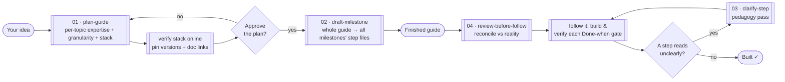

<div align="center">

# GuideForge

**Turn any idea into a step-by-step build guide that _teaches while it builds_.**

A prompt-and-skill toolkit for Claude that plans, drafts, and hardens **learn-as-you-go** developer guides — for games, libraries, web apps, CLIs, APIs, anything. The reader follows it start to finish and *understands what they're doing*, even for the parts they've never seen.

`MIT License` · `Works with Claude | Claude Code` · `Domain-agnostic` · `v1.8.0` · `PRs welcome`

[Quick start](#quick-start-15-minutes) · [The toolkit](#the-toolkit) · [Learning path](#learning-path) · [Examples](EXAMPLES.md) · [Explainer](EXPLAINER.md) · [FAQ](#faq)

</div>

---

In the age of AI, it has never been easier to ship code you don't understand. You describe a feature, the
model produces a working diff, you merge it — and step by step you lose contact with your own codebase. The
code runs, but *you* couldn't have written it, can't reason about it, and can't fix it when reality drifts
from the happy path. The skill that atrophies isn't typing; it's **understanding how things actually work.**

GuideForge takes your idea and turns it into a guide that builds the thing and explains how it works as it
goes — every action placed, every term defined, every milestone proven runnable before the next begins. The
model still does the planning and drafting; the intent is that the output leaves you able to reason about and
maintain the result, not just run it.

> **Read what the model produces.** Every plan, step, and generated guide is meant to be read and understood,
> not merged on faith. If you skim the output and ship it blind, you lose the main benefit the toolkit is
> meant to provide.

---

## Table of contents

- [Why this exists](#why-this-exists)
- [What you get](#what-you-get)
- [Skills at a glance](#skills-at-a-glance)
- [How it works](#how-it-works)
- [Quick start (15 minutes)](#quick-start-15-minutes)
- [The toolkit](#the-toolkit)
- [Repository map](#repository-map)
- [Learning path](#learning-path)
- [What you can build](#what-you-can-build)
- [The pedagogy in one screen](#the-pedagogy-in-one-screen)
- [Best practices](#best-practices)
- [Tips for following a guide](#tips-for-following-a-guide)
- [FAQ](#faq)
- [Troubleshooting](#troubleshooting)
- [Credits & inspiration](#credits--inspiration)
- [License](#license)

---

## Why this exists

Most AI-generated tutorials are a **flat wall of steps**. They tell you *what to type* but not *where*, *why*, or *what breaks if you get it wrong*. You copy, it works, and you've learned nothing. The moment reality drifts from the tutorial, you're stuck.

The best hand-written guides are different. They:

- **model who's reading** and calibrate every explanation to that person,
- **build in vertical slices** that each *prove something runnable*,
- **define jargon the first time it appears**,
- **say where every action happens and why**,
- and **gate every milestone with an observable acceptance test**.

GuideForge encodes that discipline as reusable prompts and skills, so Claude produces guides that *teach*, not guides that dictate.

> A guide is only as good as its model of the reader; most of the design follows from that.

---

## What you get

| | |
|---|---|
| **A planning meta-prompt** | Turns a one-line idea into a full, milestone-laddered build plan — with an audience + stack interview up front. |
| **Per-topic expertise + granularity dials** | Rates the reader **per topic** (Expert → New) so an expert gets names-only and a junior gets definitions, doc links, and deep dives — on that exact topic. A separate granularity dial sets how finely steps are cut. |
| **Live stack verification** | Interviews you for languages/versions/stack, then **checks the web** for the latest stable versions and pins them with official doc links — so the guide is built on current facts, not stale training memory. |
| **A drafting prompt** | Expands one approved milestone into atomic, teaching step-files — built against the pinned versions, APIs re-checked against the live docs. |
| **A clarity prompt** | Runs the 7-principle pedagogy pass over any existing step to remove confusion. |
| **A review-before-follow prompt** | The gate you run before *acting on* any guide, so stale/ambiguous steps get fixed first. |
| **A Claude Code plugin** | Installs as one plugin — ten guide-authoring slash-command skills (the four pipeline stages plus `/modernize-guide`, `/audit-guide`, `/scaffold-guide`, `/update-stack`, `/report-issue`, `/log-feedback`), each also accepting optional attached files, plus `/pre-pr-check` for contributors to the plugin itself. |
| **Copy-paste templates** | Guide README (front door), milestone overview, step file, verified-stack table, status authority, glossary, conventions, decision log. |
| **Reference docs** | The pedagogy rules, milestone-design method, and audience-modeling method — all explained. |
| **[EXPLAINER.md](EXPLAINER.md)** | Every file, every rule, every design decision — explained from scratch. Start here if you want the *why*. |

---

## Skills at a glance

Eleven skills, one plugin. What each does *for you* — invoke any as a `/slash-command`, or paste its twin prompt in a plain chat.

**Build a guide (the pipeline):**

| Skill | What it does for you |
|---|---|
| `/plan-guide` | Turns a one-line idea into a full milestone-laddered build plan — after an audience + live-stack interview. |
| `/draft-milestone` | Expands the approved plan into atomic, teaching step-files — the whole guide (all milestones) in one pass, built against the pinned versions. |
| `/clarify-step` | Runs the 7-principle pedagogy pass over one existing step to remove confusion — without changing what it does. |
| `/review-before-follow` | Reconciles a guide with reality *before* you follow it — catches stale APIs, moved files, renamed UI. |

**Set up, QA & maintain:**

| Skill | What it does for you |
|---|---|
| `/scaffold-guide` | Stamps the guide's folder skeleton + five foundation docs from the approved plan, so drafting starts immediately. |
| `/audit-guide` | Lints a drafted guide against the GuideForge contract and reports violations, ranked by severity (read-only). |
| `/update-stack` | Re-verifies framework/library versions online and bumps the guide to current releases. |
| `/modernize-guide` | Converts an existing tutorial / README / runbook into a learn-as-you-go GuideForge plan. |
| `/report-issue` | A reader hit a real issue → fixes the root cause *everywhere* it appears and logs the fix. |
| `/log-feedback` | Captures reader friction to the guide's `feedback-log.md` — a durable record for improving the guide and the method — **without** changing the guide. |

**Contribute to GuideForge:**

| Skill | What it does for you |
|---|---|
| `/pre-pr-check` | Pre-flights a contribution to this repo before you open a PR (ground rules, registry sync, dead links). |

---

## How it works

GuideForge's core is a **pipeline of four prompts** (plus six auxiliary tools — see [the toolkit](#the-toolkit)). You stay in the loop between each stage — nothing runs end-to-end unattended.



The plan is drafted into the **whole guide in one pass**, so you have it in hand before you build. Each milestone still ends in a **gate** — an observable *Done-when* check you verify as you follow the guide — so verification is built into the guide rather than added at the end.

---

## Quick start (15 minutes)

### Option A — Plain Claude (any chat, no install)

1. Open [`skills/plan-guide/prompt.md`](skills/plan-guide/prompt.md).
2. Copy the whole file into a new Claude conversation.
3. Replace `{{IDEA}}` with your idea, e.g. *"a REST API for a bookstore in Go"*.
4. Answer the 7 audience/scope questions Claude asks. *(Optional: attach an existing spec, design doc, or
   sample code — Claude reads them and folds them into the plan.)*
5. You get a complete build plan. Approve it, then paste [`skills/draft-milestone/prompt.md`](skills/draft-milestone/prompt.md) to draft the whole guide (all milestones) in one pass.

### Option B — Claude Code (install as a plugin)

GuideForge ships as a Claude Code **plugin** — install it once and all the skills come with it (the ten
guide-authoring skills plus `/pre-pr-check` for contributors; each keeps its own slash command). Point Claude
Code at a checkout, then install:

```
/plugin marketplace add /path/to/guide-forge
/plugin install guide-forge@guide-forge
```

> Installed as a plugin, the commands may be **namespaced** — `/guide-forge:plan-guide` — if a bare
> `/plan-guide` is ambiguous with another plugin. Copied into `.claude/skills/` (below), the bare names
> always work.

Prefer to hand-pick? Copy skill folders into `.claude/skills/`. Each skill folder is **self-contained** — its
`SKILL.md` wrapper and its `prompt.md` contract sit side by side — so there's nothing else to copy:

```bash
mkdir -p .claude/skills
cp -r skills/* .claude/skills/      # or copy only the ones you want — each carries its own prompt.md
```

Then in Claude Code:

```
/plan-guide a CLI that syncs Notion pages to local Markdown
```

### Option C — Always-on (paste into CLAUDE.md)

Append the pedagogy rules (the writing contract) from [`reference/pedagogy-rules.md`](reference/pedagogy-rules.md) to your `~/.claude/CLAUDE.md` so *every* guide Claude writes for you follows the rules by default.

> **Small guide?** If your idea is a single doc under ~2 hours, tell Claude *"lite mode"* — it skips the heavy foundation/verification phases and collapses the ladder to 2–3 milestones. See [the lite-mode note](reference/milestone-design.md#lite-mode).

---

## The toolkit

| # | Tool | Invoke | Persistence | Use it when… |
|---|------|--------|-------------|--------------|
| 01 | [plan-guide](skills/plan-guide/prompt.md) | paste prompt / `/plan-guide` | one-shot | You have an idea and need the whole plan before writing anything. |
| 02 | [draft-milestone](skills/draft-milestone/prompt.md) | paste prompt / `/draft-milestone` | one-shot (or per-milestone re-draft) | The plan is approved and you're drafting the whole guide (name a milestone to re-draft just one). |
| 03 | [clarify-step](skills/clarify-step/prompt.md) | paste prompt / `/clarify-step` | per-step | A finished step is confusing, stale, or a reader got stuck. |
| 04 | [review-before-follow](skills/review-before-follow/prompt.md) | paste prompt / `/review-before-follow` | before acting | You're about to *execute* a guide and need it reconciled vs reality first. |

**Auxiliary tools** (outside the linear pipeline):

| Tool | Invoke | Use it when… |
|------|--------|--------------|
| [modernize-guide](skills/modernize-guide/prompt.md) | paste prompt / `/modernize-guide` | You have an existing tutorial / README / runbook to convert into a learn-as-you-go guide. |
| [audit-guide](skills/audit-guide/prompt.md) | paste prompt / `/audit-guide` | You want to QA a drafted guide against the contract before shipping it (read-only). |
| [scaffold-guide](skills/scaffold-guide/prompt.md) | paste prompt / `/scaffold-guide` | The plan is approved and you want the folders + foundation docs stamped out. |
| [update-stack](skills/update-stack/prompt.md) | paste prompt / `/update-stack` | A guide's framework/library versions have moved and you want them re-verified, the guide brought up to date, and re-audited. |
| [report-issue](skills/report-issue/prompt.md) | paste prompt / `/report-issue` | A reader hit a real issue following the guide and you want the root cause fixed everywhere it appears, not just where they got stuck. |
| [log-feedback](skills/log-feedback/prompt.md) | paste prompt / `/log-feedback` | A reader hit friction and you want it recorded in the guide's `feedback-log.md` for later analysis — captured, not fixed (that's `report-issue`). |

**Repo maintenance** (for contributors to GuideForge itself — skill-only, no paste prompt):

| Tool | Invoke | Use it when… |
|------|--------|--------------|
| [pre-pr-check](skills/pre-pr-check/SKILL.md) | `/pre-pr-check` | You're about to open a PR against GuideForge and want every CONTRIBUTING rule + repo-consistency check confirmed first (read-only). |

**Templates** (in [`templates/`](templates/)): `readme.md`, `milestone-overview.md`, `step.md`, `verify.md`, `stack.md`, `status.md`, `glossary.md`, `conventions.md`, `decision-log.md`, `feedback-log.md`.

**Reference** (in [`reference/`](reference/)): the deep-dives — [pedagogy rules](reference/pedagogy-rules.md), [milestone design](reference/milestone-design.md), [audience model](reference/audience-model.md), [canonical layout](reference/canonical-layout.md).

---

## Repository map

```
guide-forge/                      ← a single project = one Claude Code plugin
├── .claude-plugin/               ← plugin manifest + local marketplace (install as one unit)
│   ├── plugin.json
│   └── marketplace.json
├── README.md                     ← you are here (the storefront)
├── EXPLAINER.md                  ← everything explained from scratch — read this second
├── EXAMPLES.md                   ← guides the pipeline produced, each linked in its own repo
├── LICENSE                       ← MIT
├── CHANGELOG.md
├── CONTRIBUTING.md
├── package.json                  ← repo tooling only (`npm test`); deliberately carries no version
│
├── skills/                       ← one folder per tool: a SKILL.md wrapper + its prompt.md contract
│   │                               (prompt.md = the paste-in-any-chat twin AND the single source of truth)
│   ├── plan-guide/               ← pipeline 01 · SKILL.md + prompt.md
│   ├── draft-milestone/          ← pipeline 02 · SKILL.md + prompt.md
│   ├── clarify-step/             ← pipeline 03 · SKILL.md + prompt.md
│   ├── review-before-follow/     ← pipeline 04 · SKILL.md + prompt.md
│   ├── modernize-guide/          ← auxiliary · SKILL.md + prompt.md
│   ├── audit-guide/              ← auxiliary · SKILL.md + prompt.md
│   ├── scaffold-guide/           ← auxiliary · SKILL.md + prompt.md
│   ├── update-stack/             ← auxiliary · SKILL.md + prompt.md
│   ├── report-issue/             ← auxiliary · SKILL.md + prompt.md
│   ├── log-feedback/             ← auxiliary · SKILL.md + prompt.md
│   └── pre-pr-check/SKILL.md     ← repo maintenance (self-contained; no prompt.md)
│
├── templates/                    ← copy-paste scaffolds a generated guide uses
│   ├── readme.md                  ← the generated guide's front door (objective · stack summary · updates)
│   ├── milestone-overview.md
│   ├── step.md
│   ├── verify.md                  ← the NN_verify.md gate + per-milestone full-file checkpoint
│   ├── stack.md                   ← verified versions + official doc links (from the web check)
│   ├── status.md
│   ├── glossary.md
│   ├── conventions.md
│   ├── decision-log.md
│   └── feedback-log.md            ← append-only reader-friction log (seeded by scaffold-guide)
│
├── reference/                    ← the method, explained
│   ├── pedagogy-rules.md
│   ├── milestone-design.md
│   ├── audience-model.md
│   └── canonical-layout.md        ← the one fixed on-disk skeleton every guide uses
│
└── scripts/                      ← repo maintenance (run via `npm test` / `npm run …`)
    ├── check-version.mjs          ← version stamps agree, and the released version is tagged
    ├── check-consistency.mjs      ← skill frontmatter, wrappers, counts, dead links
    ├── release.mjs                ← the ONLY intended way the version moves
    └── doctor.mjs                 ← is your installed plugin cache stale vs this working tree?
```

---

## Learning path

New here? Follow this order.

| Step | Read / do | Time | You'll understand… |
|------|-----------|------|--------------------|
| 1 | [EXPLAINER.md](EXPLAINER.md) → "Philosophy" | 10 min | Why learn-as-you-go beats a wall of steps. |
| 2 | [reference/audience-model.md](reference/audience-model.md) | 10 min | The single most important input to any guide. |
| 3 | [reference/milestone-design.md](reference/milestone-design.md) | 15 min | How to cut a ladder that always builds on a proven base. |
| 4 | [reference/pedagogy-rules.md](reference/pedagogy-rules.md) | 20 min | The 7 principles that make a step *teach*. |
| 5 | Run [skills/plan-guide/prompt.md](skills/plan-guide/prompt.md) on your own idea | 30 min | The whole thing, hands-on. |

---

## What you can build

| You want… | Feed the idea… | You'll get a guide that teaches… |
|-----------|----------------|----------------------------------|
| A learning course | "a 2D platformer in Godot for a web dev" | Game-loop concepts, scene trees, physics — bridged from web mental models. |
| Onboarding docs | "our internal deploy pipeline for new hires" | Your house tooling, with the tribal knowledge made explicit. |
| A library tutorial | "a rate-limiter library in Rust" | Ownership, trait design, and testing — as the library grows. |
| A workshop | "build a RAG chatbot in an afternoon" | Embeddings, vector search, and prompt design, milestone by milestone. |
| A migration runbook | "move our REST API to gRPC" | The *why* behind each change, not just the diff. |

**See one for real.** [**EXAMPLES.md**](EXAMPLES.md) indexes guides the pipeline produced, each published as
its own repo — starting with a ~42-step one that takes a total beginner to a working 2D browser platformer.

---

## The pedagogy in one screen

Every generated step obeys **seven principles** (full detail + before/after in [reference/pedagogy-rules.md](reference/pedagogy-rules.md)):

1. **Explain what's new** — define every concept on first use at its topic's depth (inline, or a "New concept" callout right above the line); teach the recurring mental model where it first bites.
2. **Anchor every action** — say WHERE it happens (file / menu / command / URL), and WHAT it does and WHY.
3. **Leave nothing ambiguous** — exact values not ranges; mandatory vs illustrative marked; what to change vs leave at default; load-bearing vs cosmetic names flagged; a recurring value defined once and identical everywhere; every identifier the guide writes self-describing (`elapsedMs`, not `d`).
4. **Structure steps & code** — numbered lists, never arrow-chains; each code block directly under the instruction it implements; add to an existing file (fragment + a unique anchor), never re-paste it whole; every step ends on a green build — never "this error is expected, the next step fixes it".
5. **Anticipate failure** — name the likely error and its usual cause.
6. **Prove the gate** — a Done-when must exercise the exact property it claims, and stay observable in the environment you told the reader to watch (no debug session or dev mode masking the signal).
7. **Declare the starting state** — never silently assume an install, a running service, a login, or a prior artifact.

---

## Best practices

**Do**

- Answer the audience interview honestly and specifically — it drives everything.
- Approve the plan before drafting. Fixing a ladder is cheap; re-drafting ten milestones is not.
- Verify each milestone's *Done-when* gate before moving to the next.
- Let the guide's `status.md` be the single source of truth for what's actually done.

**Don't**

- Skip Phase 0 to "save time" — a vague audience model produces a generic guide.
- Skip the plan-approval gate. The whole guide is drafted off the ladder in one pass — approve it wrong and that's ten milestones to redo.
- Trust a guide's "done" language over reality. Reconcile first (prompt 04).
- Over-explain what the reader already knows — that's as harmful as under-explaining.

---

## Tips for following a guide

Best practices above are for *making* a guide. These are for the person **following** one — read them before
you start building against it.

- **Don't just copy-paste.** Every step tells you *where* the code goes and *why* it's there — that context is
  the point. Type it, or at minimum read the explanation before you paste the block. A guide you paste your
  way through teaches you nothing, and you won't be able to debug it when it breaks.
- **Follow the whole guide before adding your own changes.** Resist the urge to refactor, rename, or expand as
  you go. Later steps build on the exact state the earlier ones left behind — file names, function signatures,
  folder layout — so an early "improvement" can make the next steps hard or impossible to follow. Reach the
  last milestone's *Done-when* gate first, then make the project yours.
- **Keep `foundation/glossary.md` open.** When a term you don't know shows up, look it up instead of
  pattern-matching the code around it. The guide defines its vocabulary on purpose — the definitions are what
  let you read the *next* step without guessing.
- **When something breaks, read the step's failure note first.** Every step names the error you're most likely
  to hit and its usual cause. The answer is often already on the page, before you open a search engine.
- **Don't hand a milestone to the AI.** Asking a model to "just do this part for me" produces exactly the code
  you can't reason about — the problem the guide exists to avoid. Ask it to *explain* a step you're stuck on,
  not to complete it.
- **Assume the guide can be wrong or out of date.** It was written against a snapshot of the world. Steps that
  touch **external platforms** — cloud consoles, dashboards, OAuth screens, app stores, third-party APIs — age
  fastest: buttons get renamed, settings move, free tiers change, endpoints get deprecated. If what you see
  doesn't match what the step describes, trust the platform and adapt, don't force the guide's exact wording.
  Running `/review-before-follow` before you start catches much of this up front.
- **Report the friction you hit.** `/report-issue` if you want the guide fixed, `/log-feedback` if you just
  want it recorded. The exact place you got stuck is the most valuable data the guide can get.

---

## FAQ

**Is this only for Claude Code?**
No. Each skill's `prompt.md` is a paste-into-any-chat prompt that works in any Claude conversation (or the API); the `SKILL.md` wrappers are just the Claude Code convenience layer over those same prompts.

**Does it write the whole guide automatically?**
Yes — once you approve the plan, `draft-milestone` drafts every milestone in one pass, so you have the finished guide before you build. The human gate is **plan approval** (get the ladder right before ten milestones are written off it); you then build against the guide, verifying each milestone's *Done-when* gate as you go.

**How is this different from "write me a tutorial" prompts?**
Those generate content. GuideForge generates a *verified, milestone-gated, audience-modeled plan* and then teaching step-files — with an explicit 7-principle writing contract. See [Why this exists](#why-this-exists).

**Can I use it for non-code guides?**
It's tuned for software, but the method (audience model → ladder → gated steps) transfers to anything procedural. Your mileage varies.

**How do I keep a generated guide from going stale?**
Use prompt 04 (review-before-follow): before executing a guide against real code/tools, reconcile it — reality wins, and you log the drift in `status.md`.

**Where did this come from?**
Distilled from a real doc-driven, solo-dev build system. See [Credits](#credits--inspiration).

---

## Troubleshooting

| Symptom | Likely cause | Fix |
|---------|-------------|-----|
| Plan feels generic | Audience interview answered vaguely | Re-run Phase 0; rate each topic concretely on the per-topic matrix (Expert → New). |
| Milestones can't be run on their own | Ladder was cut into horizontal layers | Re-cut into vertical slices — see [milestone-design.md](reference/milestone-design.md). |
| Steps are too long / do many things | Atomicity rule ignored | Run [clarify-step](skills/clarify-step/prompt.md); split by "one indivisible action." |
| Reader keeps hitting undefined terms | Rule 1.1 not applied | Run clarify-step; add a per-step glossary. |
| Guide worked once, breaks now | Drifted from reality | Run [review-before-follow](skills/review-before-follow/prompt.md). |

---

## Credits & inspiration

- **Method** distilled from a real doc-driven, milestone-laddered solo-dev build kit (the "learn-as-you-go, milestone-laddered" workflow, an atomic step-file contract, and a trigger-gated clarity protocol).
- **Repo shape** inspired by the excellent [luongnv89/claude-howto](https://github.com/luongnv89/claude-howto).
- Built to be **meta-prompting** in the classic sense — one reusable prompt that solves a whole category of tasks.

Contributions welcome — see [CONTRIBUTING.md](CONTRIBUTING.md).

---

## License

[MIT](LICENSE) © 2026. Use it, fork it, ship guides with it.
